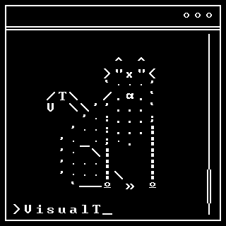

# VisualT

  

### VisualT is a cross-platform C library that makes creating UTF8 text-based UIs easier and faster.
* The documentation is available on: <https://visualt.readthedocs.io/en/latest/>
* Build instructions are available [here](https://visualt.readthedocs.io/en/latest/build/import.html).

----

**Long-term goals:**

* [ ] deliverable as a hunter package
* [ ] documentation
  * [ ] examples
* [ ] better tests
* [ ] improve ci
  * [ ] coverage stats
